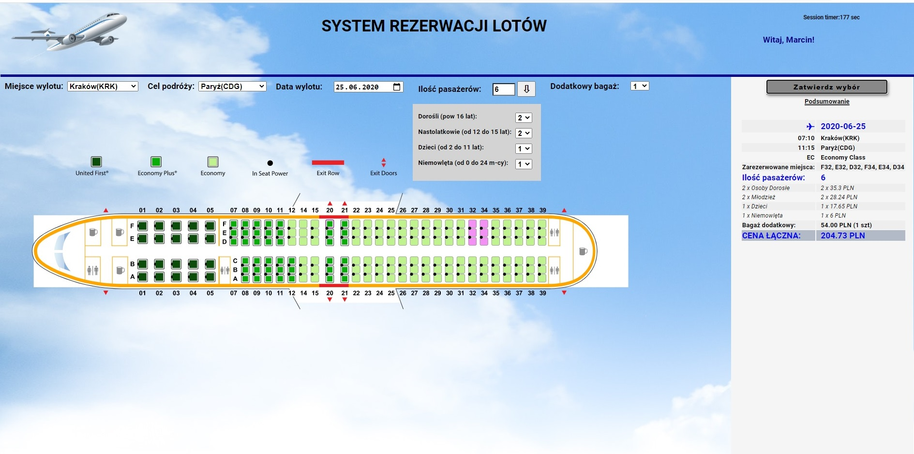

## Table of contents
* [General info](#general-info)
* [Technologies](#technologies)
* [Setup](#setup)

## General info
The project includes an airplane ticket booking system with the following options:
1. Logging in
2. Choosing the date / destination / number of people
3. Choosing a seat on the plane
4. Choice of additional options (luggage, tariff)
5. Summary of the order

The project includes an air ticket booking system with the following options:
1. Logging in
2. Choosing the date / destination / number of people
3. Choosing a seat on the plane
4. Choice of additional options (luggage, tariff)
5. Summary of the order
Personal data and data on seating, prices are downloaded from external JSON files.
As a destination user can choose 3 cities (in Poland, Europe and USA). Depending on the destination chosen, the user will see a different type of airplane with the correct seating arrangement:
- Bombardier in domestic flight (Poland),
- Boeing 737 on continental flight (Europe)
- Boeing 757 on intercontinental flight (to USA)
When you click on a specific seat, it changes color which means pre-booking. The type of seat is read and priced accordingly to the final price.
The departure date can be selected from the current date to a maximum of 1 year ahead. There is a maximum limit of 9 people.
The user can change the choice of seating positions, choose additional luggage (additional fee).
Summary visible after confirming the entered data and after logging in.
Logging in is done by checking the data provided by the user (comparison to data from a JSON file).
The login session lasts max. 3 minutes - after this time the user will be automatically log out.
	
## Technologies
Project is created with:
* HTML 5
* SCSS
* RWD
* SVG
* Javascript / ECMAScript 6
* Node.js
	
## Setup
To run this project, install it locally using npm:

```
$ cd ../project_folder
$ npm install
$ npm node app
```
## Screen from app
 